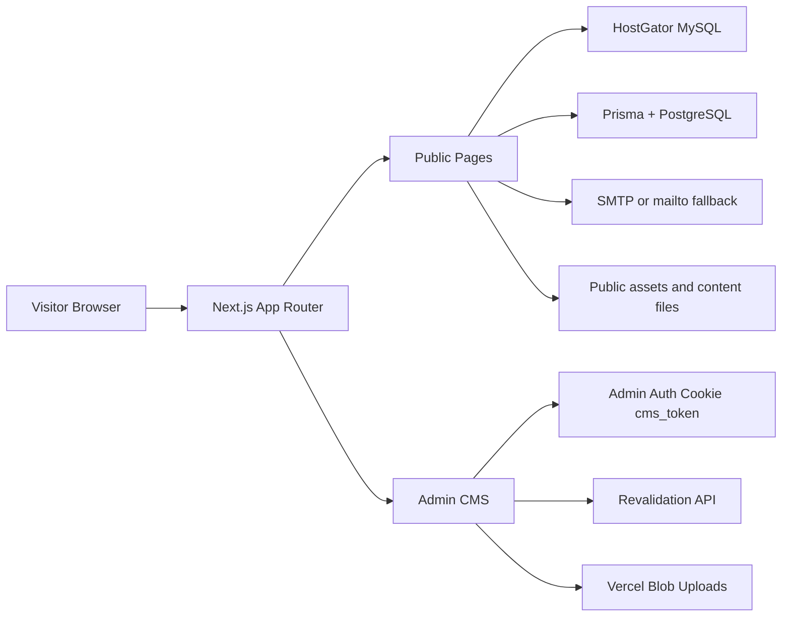

# Haines City Dental

This repository is the production website and CMS for Haines City Dental. It combines a public marketing site, a content management dashboard, contact and appointment workflows, image upload support, and several migration/utilities scripts that were used to move content from older systems into the current Next.js application.

The project is intentionally hybrid. Public CMS content for news, team, and staff uses HostGator MySQL through `lib/mysql.ts`, while doctor records use Prisma against PostgreSQL through `lib/prisma.ts` and `prisma/schema.prisma`. The site also keeps markdown and JSON content collections under `content/` for reusable static content and migration-friendly data.

## What Is In The Project

- Public pages for home, services, news, contact, our practice, our team, team, patient information, testimonials, and privacy.
- An admin CMS for managing news and team content, plus one-time database setup and ordering tools.
- Authentication built around an httpOnly `cms_token` cookie and middleware-based route protection.
- Contact and appointment forms with email delivery through SMTP when configured, plus a mailto fallback when it is not.
- Direct-to-Vercel-Blob image uploads for CMS editing flows.
- SEO support through `sitemap.ts`, `robots.ts`, metadata in the root layout, and image optimization in `next.config.js`.

## Architecture



## Technology Stack

- Next.js 14 with the App Router.
- React 18 and TypeScript.
- Tailwind CSS with a custom dental-blue palette and legacy Medikan theme overrides.
- Framer Motion for header and page motion.
- Lucide React icons.
- Prisma for doctor data.
- mysql2 for the HostGator-backed CMS content.
- bcryptjs and jsonwebtoken for authentication support.
- nodemailer for contact and appointment email delivery.
- @vercel/blob for image upload handling.

## Key Runtime Files

- [src/app/layout.tsx](src/app/layout.tsx) sets the global metadata, layout shell, header/footer, particle background, scroll progress, and page transition wrappers.
- [middleware.ts](middleware.ts) protects `/admin` and `/api/admin/*` routes, redirects unauthenticated users to login, and sends no-cache headers for admin pages.
- [src/app/admin/layout.tsx](src/app/admin/layout.tsx) performs client-side auth verification and auto-logs out inactive users after 15 minutes.
- [src/app/api/admin/login/route.ts](src/app/api/admin/login/route.ts) issues the `cms_token` cookie.
- [src/app/api/revalidate/route.ts](src/app/api/revalidate/route.ts) refreshes public paths after CMS updates.
- [src/app/api/upload/route.ts](src/app/api/upload/route.ts) authorizes and brokers Vercel Blob uploads.
- [src/app/api/send-email/route.ts](src/app/api/send-email/route.ts) sends contact and appointment messages.
- [next.config.js](next.config.js) enables standalone output, image optimization, and security headers.
- [src/app/robots.ts](src/app/robots.ts) and [src/app/sitemap.ts](src/app/sitemap.ts) provide crawl metadata.

## Public Routes

| Route | Purpose | Source |
| --- | --- | --- |
| `/` | Home page with hero content, appointment panel, and featured promos. | [src/app/page.tsx](src/app/page.tsx) |
| `/services` | Interactive service catalog with tabbed categories and service navigation. | [src/app/services/page.tsx](src/app/services/page.tsx) |
| `/news` | Public news feed with image galleries and lightbox viewing. | [src/app/news/page.tsx](src/app/news/page.tsx) |
| `/contact` | Contact form, office details, and embedded map. | [src/app/contact/page.tsx](src/app/contact/page.tsx) |
| `/our-practice` | Practice overview, office imagery, and appointment call-to-action. | [src/app/our-practice/page.tsx](src/app/our-practice/page.tsx) |
| `/our-team` | Team directory split into doctors and staff. | [src/app/our-team/page.tsx](src/app/our-team/page.tsx) |
| `/team` | Alternate team listing grouped into doctors, hygienists, and staff. | [src/app/team/page.tsx](src/app/team/page.tsx) |
| `/patient-info` | New patient information, forms, and HIPAA resources. | [src/app/patient-info/page.tsx](src/app/patient-info/page.tsx) |
| `/testimonials` | Testimonials page rendered through the shared testimonials component. | [src/app/testimonials/page.tsx](src/app/testimonials/page.tsx) |
| `/privacy` | Redirects to the HIPAA privacy notice PDF. | [src/app/privacy/page.tsx](src/app/privacy/page.tsx) |
| `/doctors` | Redirects to `/our-team` instead of serving a separate page. | [src/app/doctors/page.tsx](src/app/doctors/page.tsx) |

Notes:

- The current header navigation points to Home, Our Practice, Services, Our Team, Patient Information, News, and Contact Us.
- There is no live `/staff` route file in the current tree; staff content is surfaced through `/our-team` and `/team`.
- `GET /api/health` is a diagnostic endpoint, not a public content page.

## Page-By-Page Walkthrough (Public Site)

This section documents what actually renders on each public route, field-by-field, so the behavior does not have to be reverse-engineered from the components.

### `/` — Home ([src/app/page.tsx](src/app/page.tsx))

- Server component. Renders [Hero](src/components/Hero.tsx) as the main content in a 4-column area.
- A 1-column right-hand `aside` panel (desktop) shows: a "Call for Appointment" image linking visually to scheduling, a "Schedule an appointment" button that links to `/contact`, two promo images (Nitrous Oxide Sedation, Snoring & Sleep Apnea/Snoring Devices), and a patient-testimonials teaser image that links to `/testimonials`.
- All imagery is served through `next/image` with explicit width/height and `quality={90}`.

### `/services` — Services ([src/app/services/page.tsx](src/app/services/page.tsx))

- Client component wrapped in `Suspense`, reads a `?tab=<id>` query param on mount to pre-select a category (used for deep-linking from the header/footer).
- A hard-coded array of 7 service categories drives the whole page: **Cosmetic Dentistry, General Dentistry, Implant Dentistry, Periodontal Therapy, Sedation Dentistry, Orthodontics, Snoring & Sleep Apnea**. Each entry has an id, title, subtitle, a paragraph description, 4 bullet points, a hero image, and an icon.
- UI is a pill-tab selector across the top plus a large two-column "active category" card (image left, copy + bullets + "Schedule Consultation" `tel:` link right), with left/right chevron buttons and dot indicators to step through categories without using the tabs.
- This content is fully static/in-component — it is not sourced from `content/services/*.md` even though those markdown files exist in the repo (see Implementation Notes).

### `/news` — News ([src/app/news/page.tsx](src/app/news/page.tsx))

- Client component. Fetches `GET /api/news` on mount with retry logic: up to 3 attempts with exponential backoff (1s, 2s, capped at 5s); if all retries fail it shows an error message and force-reloads the page after 2 seconds.
- Renders each news item as a card: title, date (with a calendar icon), description, and a thumbnail grid (4 columns on mobile, 8 on desktop) built from the item's `images[]` array (falling back to a single `image` field).
- Clicking a thumbnail opens [Lightbox](src/components/Lightbox.tsx), a full-screen image viewer seeded with that item's image list and the clicked index.
- Shows an empty state ("No news items available") when the feed returns zero items.

### `/contact` — Contact ([src/app/contact/page.tsx](src/app/contact/page.tsx))

- Client component with a two-column layout: office/contact info cards on the left, a contact form on the right, and an embedded Google Maps iframe below both.
- Left column cards: address (35914 Highway 27 South, Suite 2B, Haines City, FL 33844), phone numbers (1-877-288-3384 and 863-422-8338, both `tel:` links), hours (Monday–Thursday, 7:00 AM–3:00 PM), and email (office@hainescitydental.com, a `mailto:` link).
- Form fields: Name, Email, Phone (optional), Message. On submit it `POST`s to `/api/send-email` with `type: 'contact'`. If the API reports SMTP isn't configured (`useMailto: true`), the page opens the visitor's mail client via a pre-filled `mailto:` link instead. A success state and inline error banner are both handled client-side.
- The map is a static Google Maps embed (`output=embed`) pointed at the practice address, lazy-loaded.

### `/our-practice` — Our Practice ([src/app/our-practice/page.tsx](src/app/our-practice/page.tsx))

- Server component, same 4/1 column shell as the home page (main content + appointment aside).
- A single intro paragraph about the practice's philosophy (prevention, restorative and cosmetic care, patient communication, a "relaxing environment").
- A 6-image gallery grid with captions: reception area, team-at-work, and four generic office photos (`office1.jpg`–`office5.jpg`), each captioned (e.g. "Modern dental facility," "State-of-the-art equipment").
- Shares the same right-hand appointment aside as the home page (call image + "Schedule an appointment" button to `/contact`).

### `/our-team` — Our Team ([src/app/our-team/page.tsx](src/app/our-team/page.tsx))

- Client component. Fetches `GET /api/team` with the same retry/backoff/reload pattern as `/news`.
- Splits the flat team list into two sections by inspecting each member's `department` string: any department containing "doctor" → **Meet Our Doctors**; everything else → **Meet Our Staff**.
- Each member renders as a stacked card: photo (if present), name, role, and bio (whitespace-preserved, justified text).
- This is the page the header/footer actually link to for team content.

### `/team` — Team (alternate listing) ([src/app/team/page.tsx](src/app/team/page.tsx))

- Client component. Also fetches `GET /api/team`, but splits members into three groups by an **exact** (not substring) match on `department`: `doctors`, `hygienist`, and `staff`/`assistant`. Members whose department doesn't match any of these three exactly are silently omitted from this page (unlike `/our-team`, which buckets everyone).
- Renders Doctors as large horizontal cards, Hygienists and Staff as 2–3 column photo-card grids.
- No retry/backoff logic here — a single failed fetch just shows an error banner. This route is not in the primary header navigation; `/our-team` is the actively promoted team page.

### `/patient-info` — Patient Information ([src/app/patient-info/page.tsx](src/app/patient-info/page.tsx))

- Client component wrapped in `Suspense`, also supports `?tab=` deep-linking. Three visible tabs: **New Patients**, **New Patient Forms**, **HIPAA Forms**. (A fourth `SpecialsContent` component with promotional pricing exists in the file but is not wired into the `tabs` array or rendered — see Implementation Notes.)
- **New Patients tab**: welcome copy ("Ages 12 years old to 112 years," comprehensive dentistry, emergencies welcome), two `tel:` call buttons (1-877-288-3384 and 863-422-8338), and a full appointment-request form (First/Last Name, Email, Phone, Preferred Date, Preferred Time dropdown, "How did you hear about us?" dropdown, Additional Information). Submits to `/api/send-email` with `type: 'appointment'`, with the same mailto-fallback behavior as the contact form.
- **New Patient Forms tab**: download cards for the New Patient Registration, Medical History, and Dental History PDFs (`public/forms/*.pdf`), each opening in a new tab.
- **HIPAA Forms tab**: download cards for the HIPAA Privacy Notice and HIPAA Authorization Form PDFs.

### `/testimonials` — Testimonials ([src/app/testimonials/page.tsx](src/app/testimonials/page.tsx))

- Thin wrapper page; all rendering is delegated to the shared [Testimonials](src/components/Testimonials.tsx) component (also used in a compact form elsewhere via [TestimonialsCompact](src/components/TestimonialsCompact.tsx)).

### `/privacy` — Privacy

- Not a page in the traditional sense: a server-side `redirect()` straight to `/forms/hipaa-privacy-notice.pdf`. No HTML is rendered at this route.

### `/doctors` — Doctors

- Also a pure redirect, forwarding to `/our-team`. Kept only so old links/bookmarks to `/doctors` don't 404.

## Admin Routes

| Route | Purpose | Source |
| --- | --- | --- |
| `/admin/login` | Credential form that sets the auth cookie. | [src/app/admin/login/page.tsx](src/app/admin/login/page.tsx) |
| `/admin` | CMS dashboard with News and Our Team tabs plus display-order setup. | [src/app/admin/page.tsx](src/app/admin/page.tsx) |
| `/admin/news` | News list, drag-to-reorder, edit, delete, and revalidation. | [src/app/admin/news/page.tsx](src/app/admin/news/page.tsx) |
| `/admin/news/new` | Create news entries with gallery uploads. | [src/app/admin/news/new/page.tsx](src/app/admin/news/new/page.tsx) |
| `/admin/news/[id]` | Edit news entries and gallery images. | [src/app/admin/news/[id]/page.tsx](src/app/admin/news/[id]/page.tsx) |
| `/admin/team` | Team list, drag-to-reorder, edit, delete, and revalidation. | [src/app/admin/team/page.tsx](src/app/admin/team/page.tsx) |
| `/admin/team/new` | Create team members with optional profile image. | [src/app/admin/team/new/page.tsx](src/app/admin/team/new/page.tsx) |
| `/admin/team/[id]` | Edit team members. | [src/app/admin/team/[id]/page.tsx](src/app/admin/team/[id]/page.tsx) |

## Page-By-Page Walkthrough (Admin CMS)

### `/admin/login` — CMS Login ([src/app/admin/login/page.tsx](src/app/admin/login/page.tsx))

- Dark gradient full-screen card with Username/Password fields. Submits `POST /api/admin/login`; on success it pushes the client to whatever `?next=` path was captured (constrained to paths starting with `/admin`, defaulting to `/admin`), otherwise shows "Invalid username or password."
- If a visitor with a valid `cms_token` cookie lands here directly, [middleware.ts](middleware.ts) redirects them straight to `/admin` before this page ever renders.

### `/admin/*` shell ([src/app/admin/layout.tsx](src/app/admin/layout.tsx))

- Every admin route (except `/admin/login`) is wrapped by a client-side auth guard: on mount it calls `GET /api/admin/check`, and redirects to `/admin/login?next=<path>` if that check fails. This is a *belt-and-braces* check — `middleware.ts` already blocks unauthenticated requests at the edge, but this catches the case where a stale page is rendered in the browser after the cookie has already expired.
- Renders a persistent header with an "Admin Console" title and a Logout button (calls `POST /api/admin/logout`, then routes to `/admin/login`).
- Tracks user activity (`mousemove`, `mousedown`, `keydown`, `touchstart`, `scroll`, `wheel`, `focus`) and auto-logs-out after **15 minutes** of inactivity by calling the same logout flow.

### `/admin` — CMS Dashboard ([src/app/admin/page.tsx](src/app/admin/page.tsx))

- A tabbed dashboard with **News** and **Our Team** tabs; each tab renders the corresponding admin list component directly (it reuses `NewsAdminList` from `/admin/news/page.tsx` and `TeamAdminList` from `/admin/team/page.tsx` as embedded components, so the dashboard and the standalone `/admin/news` / `/admin/team` routes share the exact same list UI).
- A "Setup Display Order" button in the header calls `POST /api/setup-order` after a confirm() prompt — a one-time maintenance action that adds/initializes `display_order` columns on the MySQL tables. Shows a status banner with the result.

### `/admin/news` — News List ([src/app/admin/news/page.tsx](src/app/admin/news/page.tsx))

- Fetches `GET /api/news` and lists every item with title, formatted date, and a one-line description preview.
- Each row is HTML5-draggable; dragging reorders the in-memory list live, and dropping calls `POST /api/news/reorder` with the new `orderedIds` array, then triggers revalidation of `/news` and `/`. A failed save reverts by refetching the list.
- Per-row **Edit** navigates to `/admin/news/[id]`; **Delete** confirms, calls `DELETE /api/news/[id]`, revalidates `/news` and `/`, then refreshes the list.
- A **+ New** button routes to `/admin/news/new`.

### `/admin/news/new` — Create News ([src/app/admin/news/new/page.tsx](src/app/admin/news/new/page.tsx))

- Form fields: Title (required), Description (optional), Date. Two separate [ImageGallery](src/components/ImageGallery.tsx) instances — one capped at 1 image for the "Primary Image," one capped at 20 for "Gallery Images" — both upload through Vercel Blob via `/api/upload`.
- On submit, the primary image (if set) is prepended to the gallery array before `POST /api/news`, then the app revalidates `/news` and `/` and routes back to `/admin/news`.

### `/admin/news/[id]` — Edit News ([src/app/admin/news/[id]/page.tsx](src/app/admin/news/[id]/page.tsx))

- Same form shape as create, pre-populated by fetching `GET /api/news/[id]`. Submits `PUT /api/news/[id]`, revalidates the same public paths, and returns to the list.

### `/admin/team` — Team List ([src/app/admin/team/page.tsx](src/app/admin/team/page.tsx))

- Mirrors the News list exactly (drag-to-reorder via `POST /api/team/reorder`, Edit/Delete per row), but rows show name plus department/role, and revalidation targets `/team`, `/our-team`, and `/`.
- **+ Add New** routes to `/admin/team/new`.

### `/admin/team/new` and `/admin/team/[id]` — Create/Edit Team Member

- Forms capture name, role, bio, department, and an optional single profile image (uploaded through the same Blob/`ImageGallery` flow). Writes go to `POST /api/team` or `PUT /api/team/[id]`; both revalidate `/team`, `/our-team`, and `/` afterward.

## API Surface

### Authentication and Security

| Endpoint | Purpose |
| --- | --- |
| `POST /api/admin/login` | Validates `CMS_ADMIN_USERNAME` and `CMS_ADMIN_PASSWORD`, then sets the `cms_token` cookie. |
| `GET /api/admin/check` | Verifies the admin session cookie. |
| `POST /api/admin/logout` | Clears the admin session cookie. |
| `POST /api/revalidate` | Revalidates specific public paths or tags after CMS updates. |
| `POST /api/setup-order` | One-time setup for `display_order` columns in MySQL-backed tables. |

### News

| Endpoint | Purpose |
| --- | --- |
| `GET /api/news` | Lists news items for public and admin views. |
| `GET /api/news/[id]` | Fetches one news item. |
| `POST /api/news` | Creates a news item. |
| `PUT /api/news/[id]` | Updates a news item. |
| `DELETE /api/news/[id]` | Deletes a news item. |
| `POST /api/news/reorder` | Persists news ordering. |

### Team and Staff

| Endpoint | Purpose |
| --- | --- |
| `GET /api/team` | Returns team members from MySQL. |
| `GET /api/team/[id]` | Fetches one team member. |
| `POST /api/team` | Creates a team member. |
| `PUT /api/team/[id]` | Updates a team member. |
| `DELETE /api/team/[id]` | Deletes a team member. |
| `POST /api/team/reorder` | Persists team ordering. |
| `GET /api/staff` | Returns active staff records. |
| `GET /api/staff/[id]` | Fetches one staff member. |
| `POST /api/staff` | Creates staff records. |
| `PUT /api/staff/[id]` | Updates staff records. |
| `DELETE /api/staff/[id]` | Deletes staff records. |

### Doctors

| Endpoint | Purpose |
| --- | --- |
| `GET /api/doctors` | Lists active doctors from Prisma/PostgreSQL. |
| `GET /api/doctors/[id]` | Fetches one doctor record. |
| `POST /api/doctors` | Creates a doctor. |
| `PUT /api/doctors/[id]` | Updates a doctor. |
| `DELETE /api/doctors/[id]` | Deletes a doctor. |

### Utilities and Integrations

| Endpoint | Purpose |
| --- | --- |
| `POST /api/upload` | Issues a Blob upload token after auth verification. |
| `POST /api/send-email` | Sends contact or appointment form mail, or returns a mailto fallback payload when SMTP is not configured. |
| `GET /api/health` | Returns a simple environment diagnostic for HostGator variables. |

## Data And Content Model

### MySQL-backed CMS content

The following content is stored through HostGator MySQL and accessed through `lib/mysql.ts`:

- News items, including title, description, date, image(s), and display order.
- Team members, including name, role, bio, image, department, and display order.
- Staff records, including name, role, bio, image, department, experience, order, and active flag.

The MySQL helpers use `mysql2/promise` and lazily create a connection pool from:

- `HOSTGATOR_DB_HOST`
- `HOSTGATOR_DB_USER`
- `HOSTGATOR_DB_PASSWORD`
- `HOSTGATOR_DB_NAME`
- `HOSTGATOR_DB_PORT`

The CMS includes one-time and maintenance helpers for these tables:

- [src/app/api/setup-order/route.ts](src/app/api/setup-order/route.ts) adds and initializes `display_order` columns.
- [src/app/api/news/reorder/route.ts](src/app/api/news/reorder/route.ts) saves news order.
- [src/app/api/team/reorder/route.ts](src/app/api/team/reorder/route.ts) saves team order.

### Prisma-backed doctor data

Doctors use [prisma/schema.prisma](prisma/schema.prisma) and [lib/prisma.ts](lib/prisma.ts).

Current Prisma models:

- `News`
- `Doctor`
- `Staff`
- `Team`

Important implementation note: the current runtime routes for news, team, and staff use MySQL handlers, while doctors use Prisma. The schema still contains the other models, so the repository reflects both the current runtime and the migration history.

Required variable:

- `DATABASE_URL`

### Markdown, JSON, and migration content

The repository also stores content and migration source files outside the live database:

- `content/doctors/` contains markdown profiles for doctors.
- `content/news/` contains markdown news items.
- `content/services/` contains service copy.
- `content/staff/` contains markdown staff profiles.
- `content/settings/` contains JSON settings for `about.json`, `contact.json`, and `hero.json`.
- `lib/content.ts` reads markdown collections with frontmatter.
- `wordpressnewspage.txt` and `scripts/news-source.html` are migration source artifacts.
- `export/our-practice-wp-block.php` is a WordPress export artifact.

Current markdown inventory:

- 2 doctor profiles.
- 8 news entries.
- 7 service pages.
- 10 staff profiles.

## CMS Workflow

### Authentication

- Login is handled through `/admin/login` and `POST /api/admin/login`.
- Successful login writes an httpOnly `cms_token` cookie.
- Admin pages and write APIs verify the cookie server-side.
- The admin layout also performs a client-side check against `/api/admin/check`.
- Inactivity on admin pages triggers automatic logout after 15 minutes.

### Revalidation and publishing

- News and team writes call `/api/revalidate` after a successful create, update, delete, or reorder operation.
- Revalidation currently targets pages such as `/`, `/news`, `/team`, and `/our-team`.
- This keeps public pages in sync with CMS edits without full manual cache busting.

### Images

- CMS image uploads use [src/components/ImageGallery.tsx](src/components/ImageGallery.tsx).
- The gallery uploads through `@vercel/blob/client` and the `/api/upload` broker route.
- Image arrays can be entered, parsed, reordered, and removed in the admin UI.
- News pages use [src/components/Lightbox.tsx](src/components/Lightbox.tsx) to view galleries on the public site.

### Email

- [src/app/contact/page.tsx](src/app/contact/page.tsx) submits contact messages to `/api/send-email`.
- [src/app/patient-info/page.tsx](src/app/patient-info/page.tsx) submits appointment requests to the same endpoint.
- If SMTP variables are missing, the API returns a `useMailto` payload and the UI opens a mailto fallback.

## UI And Styling System

The site uses a custom visual system rather than a stock component library:

- [src/app/globals.css](src/app/globals.css) defines the core color palette, gradients, body background, typography defaults, and Medikan-derived overrides.
- [tailwind.config.ts](tailwind.config.ts) and [tailwind.config.js](tailwind.config.js) both define the dental-blue palette and supporting theme tokens.
- The root layout loads the Inter font, adds a skip link, and mounts the global header, footer, particle background, page transition wrapper, and scroll progress bar.
- The header uses Framer Motion for animated dropdowns and mobile menu transitions.
- The public site includes a persistent CTA-oriented header, rich card styling, and a lot of glassmorphism-inspired surfaces.

### Shared components

Core layout and navigation:

- [src/components/Header.tsx](src/components/Header.tsx)
- [src/components/Footer.tsx](src/components/Footer.tsx)
- [src/components/PageTransition.tsx](src/components/PageTransition.tsx)
- [src/components/ScrollProgress.tsx](src/components/ScrollProgress.tsx)
- [src/components/SiteBannerZoomFade.tsx](src/components/SiteBannerZoomFade.tsx)
- [src/components/ParticleBackground.tsx](src/components/ParticleBackground.tsx)

Marketing and home-page blocks:

- [src/components/Hero.tsx](src/components/Hero.tsx)
- [src/components/FeaturedServices.tsx](src/components/FeaturedServices.tsx)
- [src/components/WhyChooseUs.tsx](src/components/WhyChooseUs.tsx)
- [src/components/CallToAction.tsx](src/components/CallToAction.tsx)
- [src/components/NewsTicker.tsx](src/components/NewsTicker.tsx)
- [src/components/MobileQuickActions.tsx](src/components/MobileQuickActions.tsx)
- [src/components/ScheduleAppointmentBar.tsx](src/components/ScheduleAppointmentBar.tsx)

Media and gallery helpers:

- [src/components/ImageGallery.tsx](src/components/ImageGallery.tsx)
- [src/components/Lightbox.tsx](src/components/Lightbox.tsx)
- [src/components/LightboxGallery.tsx](src/components/LightboxGallery.tsx)
- [src/components/UniversalSlider.tsx](src/components/UniversalSlider.tsx)

Team and testimonials:

- [src/components/Doctors.tsx](src/components/Doctors.tsx)
- [src/components/Staff.tsx](src/components/Staff.tsx)
- [src/components/TeamCarousel.tsx](src/components/TeamCarousel.tsx)
- [src/components/TeamCarouselServer.tsx](src/components/TeamCarouselServer.tsx)
- [src/components/Testimonials.tsx](src/components/Testimonials.tsx)
- [src/components/TestimonialsCompact.tsx](src/components/TestimonialsCompact.tsx)

## Environment Variables

Use a local `.env.local` file. The current code reads the following variables:

| Variable | Required | Used For |
| --- | --- | --- |
| `DATABASE_URL` | Yes for Prisma-backed doctor data | Prisma client and doctor routes. |
| `HOSTGATOR_DB_HOST` | Yes for MySQL CMS content | MySQL connection pool. |
| `HOSTGATOR_DB_USER` | Yes for MySQL CMS content | MySQL connection pool. |
| `HOSTGATOR_DB_PASSWORD` | Yes for MySQL CMS content | MySQL connection pool. |
| `HOSTGATOR_DB_NAME` | Yes for MySQL CMS content | MySQL connection pool. |
| `HOSTGATOR_DB_PORT` | Optional | MySQL port override. |
| `JWT_SECRET` | Yes | JWT signing and verification. Use at least 32 characters. |
| `CMS_ADMIN_USERNAME` | Yes | Admin login username. |
| `CMS_ADMIN_PASSWORD` | Yes | Admin login password. |
| `BLOB_READ_WRITE_TOKEN` | Yes for image uploads | Vercel Blob upload broker route. |
| `SMTP_HOST` | Optional | SMTP server host. |
| `SMTP_PORT` | Optional | SMTP server port. |
| `SMTP_SECURE` | Optional | SMTP TLS toggle. |
| `SMTP_USER` | Optional but needed for mail delivery | SMTP auth user. |
| `SMTP_PASS` | Optional but needed for mail delivery | SMTP auth password. |
| `SMTP_FROM` | Optional | From address for outgoing email. |
| `SMTP_TO` | Optional | Destination address for outgoing email. |

If SMTP variables are missing, the forms still work by falling back to mailto links.

## NPM Scripts

Top-level scripts from [package.json](package.json):

```bash
npm run dev      # Start the Next.js development server
npm run build    # prisma generate && next build
npm start        # Start the production server
npm run lint     # Run Next.js ESLint
npm run postinstall  # prisma generate after install
```

The build and install flow is designed so the Prisma client is always generated before production compilation.

## Utility And Migration Scripts

The `scripts/` directory contains one-off maintenance tools and import helpers:

- `import-from-txt.js` and `import-news.js` for content imports.
- `import-local-news-images.js` for image attachment work.
- `populate-images-from-html.js` for extracting image references from source HTML.
- `copy-hero-image.js` for homepage hero asset handling.
- `convert-to-webp.js`, `generate-webp.js`, `optimize-images.js`, and `optimize_public_images.js` for image conversion and compression.
- `remove_duplicate_public_images.js` and `move_bak_files.js` for cleanup tasks.
- `scan_sizes.js` and `check_missing_news_images.js` for validation.
- `fix-2019-item.js`, `fix-2020-item.js`, `fix-2021-item.js`, `fix-2024-item.js`, `fix-halloween-2017-item.js`, and `fix-woundedwarrior-item.js` for targeted content corrections.
- `ssh_tunnel.ps1` and `docs/hostgator-remote-mysql.md` for remote database access work.

## Local Setup

1. Install dependencies with `npm install`.
2. Create `.env.local` and set the required variables listed above.
3. Make sure the MySQL schema exists for news/team/staff if you intend to use the CMS.
4. Run `npm run dev`.
5. Visit `http://localhost:3000` for the public site and `http://localhost:3000/admin/login` for the CMS.

If you are working with the HostGator database locally, review [db/LOCAL_IMPORT.md](db/LOCAL_IMPORT.md), [db/hostgator_schema.sql](db/hostgator_schema.sql), [db/schema_and_sample_inserts.sql](db/schema_and_sample_inserts.sql), and [docs/hostgator-remote-mysql.md](docs/hostgator-remote-mysql.md).

## Deployment

The project is configured for Vercel, but it still depends on external services and environment variables:

- Add the environment variables from the table above in the Vercel project settings.
- Ensure the Blob token is set if you want CMS image uploads to work.
- Ensure SMTP variables are set if you want email delivery instead of mailto fallback.
- Ensure the HostGator MySQL database is reachable from the deployment environment.
- `next.config.js` already configures `output: 'standalone'` and image remote patterns for local, production, and Vercel Blob hosts.

For deployment checklists and operational notes, also read:

- [VERCEL_DEPLOYMENT_GUIDE.md](VERCEL_DEPLOYMENT_GUIDE.md)
- [VERCEL_ENV_VARS.md](VERCEL_ENV_VARS.md)
- [PRE_DEPLOYMENT_CHECKLIST.md](PRE_DEPLOYMENT_CHECKLIST.md)
- [DEPLOYMENT_AUDIT.md](DEPLOYMENT_AUDIT.md)
- [PRODUCTION_DEPLOYMENT_SUMMARY.md](PRODUCTION_DEPLOYMENT_SUMMARY.md)

## Repository Layout

```text
content/        Markdown and JSON content collections
db/             SQL schema files and import notes
docs/           Database and remote access documentation
export/         WordPress export artifacts
lib/            Shared helpers for auth, content, MySQL, Prisma, and image handling
prisma/         Prisma schema
public/         Static assets, office images, PDFs, and upload targets
scripts/        Import, repair, conversion, and optimization utilities
src/app/        App Router pages, layouts, API routes, and metadata
src/components/ Shared UI and interaction components
```

## Documentation Map

If you need deeper operational details, start with [DOCUMENTATION_INDEX.md](DOCUMENTATION_INDEX.md). The most useful supporting docs are:

- [QUICK_START.md](QUICK_START.md) for fast setup and verification.
- [CMS_USER_GUIDE.md](CMS_USER_GUIDE.md) for admin usage.
- [ADDING_GOOGLE_REVIEWS.md](ADDING_GOOGLE_REVIEWS.md) for review-related content work.
- [PROJECT_COMPLETION_SUMMARY.md](PROJECT_COMPLETION_SUMMARY.md) for the broader migration summary.
- [STATUS_DASHBOARD.md](STATUS_DASHBOARD.md) and [FINAL_COMPLETENESS_ASSESSMENT.md](FINAL_COMPLETENESS_ASSESSMENT.md) for project status.
- [VERCEL_DEPLOYMENT_GUIDE.md](VERCEL_DEPLOYMENT_GUIDE.md) and [VERCEL_ENV_VARS.md](VERCEL_ENV_VARS.md) for production setup.
- [db/LOCAL_IMPORT.md](db/LOCAL_IMPORT.md) and [docs/hostgator-remote-mysql.md](docs/hostgator-remote-mysql.md) for MySQL access details.

## Implementation Notes And Caveats

- [src/app/doctors/page.tsx](src/app/doctors/page.tsx) is a redirect, not a standalone page.
- [src/app/privacy/page.tsx](src/app/privacy/page.tsx) redirects to the HIPAA PDF in `public/forms/`.
- [src/app/sitemap.ts](src/app/sitemap.ts) still includes `/about` as a legacy sitemap entry even though the active practice page is `/our-practice`.
- `src/components/ScheduleAppointmentBar.tsx` and `src/components/MobileQuickActions.tsx` still exist, but the root layout comments note they were removed from the active shell.
- The Prisma schema still includes `News`, `Staff`, and `Team` models even though the live routes for those collections are implemented with MySQL handlers.
- [src/app/services/page.tsx](src/app/services/page.tsx) renders its 7 service categories from a hard-coded in-component array, not from `content/services/*.md`; the markdown files exist but nothing currently reads them into that page.
- [src/app/patient-info/page.tsx](src/app/patient-info/page.tsx) defines a `SpecialsContent` component with promotional pricing, but it is not included in the page's `tabs` array or rendered anywhere — it is dead code kept in the file.
- `/team` ([src/app/team/page.tsx](src/app/team/page.tsx)) buckets members by an exact match on `department` (`doctors`, `hygienist`, `staff`/`assistant`), so any member whose department string doesn't match one of those exactly is silently dropped from that page. `/our-team` uses a looser substring match (`department` containing "doctor") and shows everyone else under Staff, so the two team pages can disagree on membership for the same underlying data.
- The repository keeps both `tailwind.config.ts` and `tailwind.config.js` because the codebase has been migrated over time and both theme definitions are still present.

## License

Copyright 2024-2026 Haines City Dental. All rights reserved.
